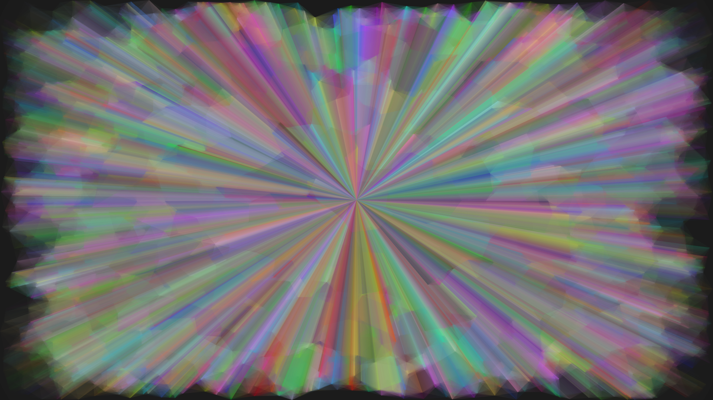

# point-line-triangle---audio-visualization
A graphic demo about points, lines, triangles and mouse cursor and audio visualization.

## Compiling
```Shell
make
```

## Usage
```
Usage   : point-line [OPTION]

Options :
    Rendering objects:
        -b        don't draw lines between nearby points
        -c        don't draw power circle around focus
        -o        don't draw lines between points and focus
        -t        don't draw triangles around focus
        -v        don't draw vertexes(points)
    Rendering arguments:
        -l DIS    set max distance between points and focus
        -m        control focus by mouse cursor
        -n NUM    set point number
        -s SPEED  set point speed
    Window:
        -d        remove window decoration
        -f        enable fullscreen
        -w SIZE   set window size(for example, 1024x768)
    Others:
        -h        show this help message and exit
        -i WAV    set input WAV file(can be empty)
        -p        print time information in terminal

Default options(with no options):
    Rendering objects:
        b: draw lines between nearby points
        c: draw power circle around focus
        o: draw lines between points and focus
        t: draw triangles around focus
        v: draw vertexes(points)
    Rendering arguments:
        l: max distance between points and focus is 0.4
        m: focus moves automatically
        n: point number is 200
        s: point speed is 1.0
    Window:
        d: enable window decoration
        f: disable fullscreen
        w: window size is 1024x768
    Others:
        h: no help message
        i: no input WAV file
        p: don't print time information in terminal
```

## Dependencies
[OpenGL - The Industry's Foundation for High Performance Graphics](https://www.opengl.org/)

[GLFW - An OpenGL library](http://www.glfw.org/)

[GLEW - The OpenGL Extension Wrangler Library](http://glew.sourceforge.net/)

[GLM - OpenGL Mathematics](http://glm.g-truc.net/0.9.6/index.html)

[ALSA - Advanced Linux Sound Architecture](http://www.alsa-project.org/main/index.php/Main_Page)

## Examples & Screenshots
```Shell
./point-line-triangle -dfw1920x1080 -n500 -itest.wav
```


- - -

```Shell
./point-line-triangle -dfw1920x1080 -n500 -itest.wav -b
```


- - -

```Shell
./point-line-triangle -dfw1920x1080 -n1000 -itest.wav -m -bov
```


- - -

```Shell
./point-line-triangle -dfw1920x1080 -n2000 -itest.wav -ml2 -bov
```


- - -

```Shell
./point-line-triangle -dfw1920x1080 -n2000 -itest.wav -m -btc
```


- - -

```Shell
./point-line-triangle -dfw1920x1080 -n100000 -itest.wav -m -btc
```


- - -

```Shell
./point-line-triangle -dfw1920x1080 -n500 -itest.wav -m -tco
```


- - -

```Shell
hacked
```


